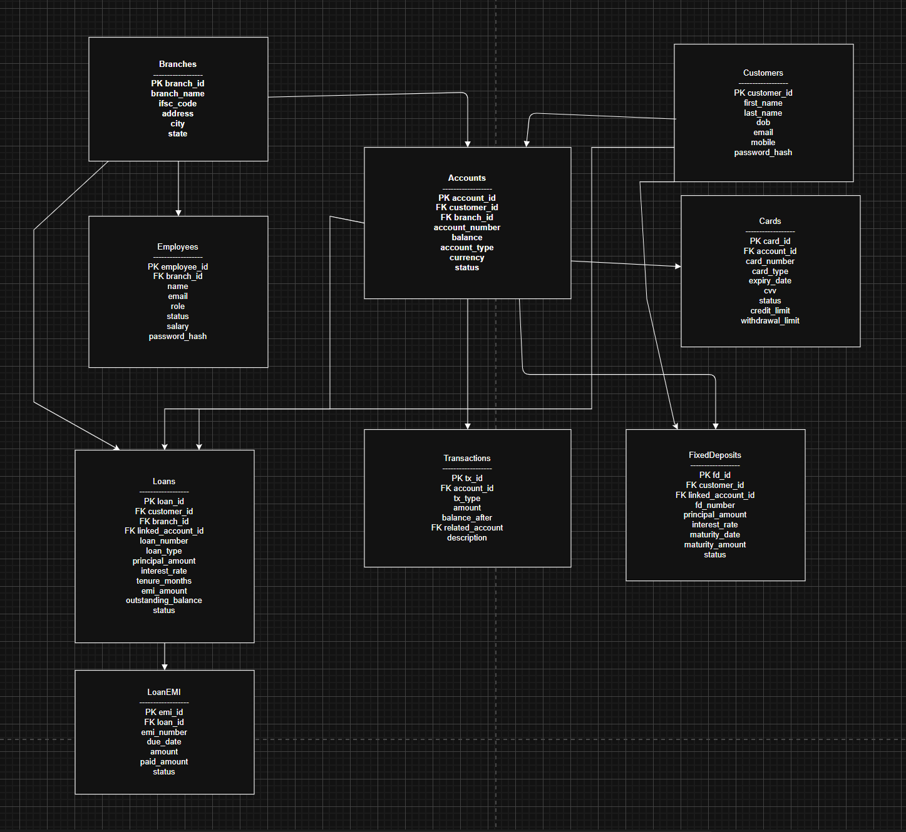

# BankBase 🏦
> A relational database system for core banking operations, built as a DBMS learning project.

---

## Overview

BankBase is a structured PostgreSQL database that models the core operations of a banking system. It covers account management, transactions, loans, fixed deposits, cards, and branch/employee management.

---

## Schema

The database consists of the following tables:

- **Branches** — Bank branches with location and IFSC details
- **Customers** — Customer personal information
- **Employees** — Branch staff with roles and status
- **Accounts** — Customer bank accounts (savings, current, etc.) linked to branches
- **Cards** — Debit/credit cards linked to accounts
- **Transactions** — All account transactions including transfers via `related_account`
- **Loans** — Loans linked to accounts and approved by employees
- **LoanEMI** — EMI schedule and payment tracking for each loan
- **FD** — Fixed deposits linked to accounts with maturity tracking



---

## Tech Stack

- **Database:** PostgreSQL
- **Hosted on:** Supabase (shared team database)
- **Version Control:** GitHub

---

## Getting Started

### Prerequisites
- [PostgreSQL](https://www.postgresql.org/download/) (v14+)
- [pgAdmin](https://www.pgadmin.org/) (optional, for GUI)

### Setup

1. Clone the repository:
   ```bash
   git clone https://github.com/your-username/bankbase.git
   cd bankbase
   ```

2. Create the database:
   ```bash
   psql -U postgres -c "CREATE DATABASE bankbase;"
   ```

3. Run the DDL script to create all tables:
   ```bash
   psql -U postgres -d bankbase -f scripts/schema.sql
   ```

4. Seed the database with sample data:
   ```bash
   psql -U postgres -d bankbase -f scripts/seed.sql
   ```

---

## Project Structure

```
bankbase/
├── scripts/
│   ├── schema.sql       # All CREATE TABLE statements
│   ├── seed.sql         # Sample data for testing
│   └── queries.sql      # Practice/demo queries
├── docs/
│   └── er_diagram.png   # ER diagram
└── README.md
```

---

## Team Collaboration

This project uses **Supabase** as a shared hosted PostgreSQL instance. To connect:

1. Get the connection string from your team lead
2. Use it in pgAdmin or psql:
   ```
   postgresql://postgres:[password]@[host]:5432/bankbase
   ```

All schema changes must be committed to GitHub as `.sql` scripts before applying to the shared database.

---

## Contributors

- Your Name
- Teammate 1
- Teammate 2

---

## License

This project is for educational purposes only.
