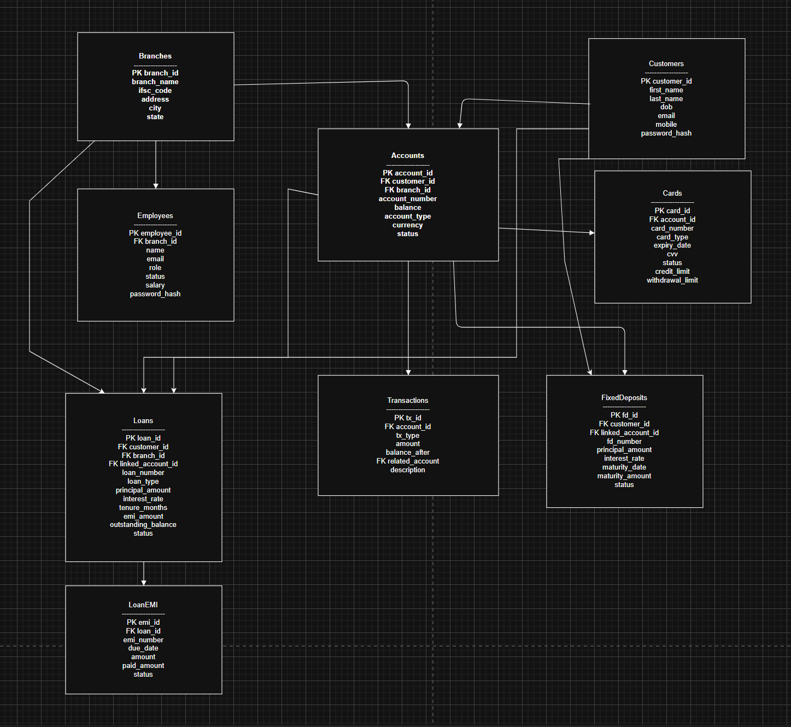

# BankBase 🏦
> A relational database system for core banking operations, built as a DBMS learning project.

---

## 📖 Table of Contents
- [Project Overview](#-project-overview)
- [Problem Statement](#-problem-statement)
- [Key Features](#-key-features)
- [Database Schema Design](#-database-schema-design)
- [Constraint Specifications](#-constraint-specifications)
- [Tech Stack](#-tech-stack)
- [Getting Started](#-getting-started)
- [Directory Structure](#-directory-structure)
- [Development Conventions](#-development-conventions)

---

## 🏦 Project Overview
BankBase is a full-stack banking management system designed to handle core banking operations. It provides a robust relational database model and a web-based interface for two primary user groups: **Customers** and **Bank Employees**. 

The project focuses on data integrity, transaction consistency, and administrative oversight, simulating real-world banking workflows such as account management, money transfers, loan processing, and financial reporting.

---

## 🎯 Problem Statement
Traditional banking systems require high availability, strict data consistency (ACID properties), and complex relationship management between entities like customers, accounts, branches, and transactions. 

The goal of BankBase is to build a scalable and secure relational database schema that:
1. Prevents data redundancy using normalization.
2. Ensures financial integrity through database-level constraints.
3. Provides a user-friendly interface for non-technical users to interact with complex SQL-driven logic.
4. Implements role-based access control (RBAC) for customers and staff.

---

## ✨ Key Features

### 👤 Customer Portal
- **Dashboard:** Overview of account balances, recent transactions, and active loans.
- **Account Management:** Open new savings or current accounts.
- **Money Transfer:** Secure peer-to-peer transfers between accounts within the bank.
- **Transaction History:** Detailed logs of all credits and debits with balance tracking.
- **Loans & FDs:** Apply for loans, view EMI schedules, and manage fixed deposits.
- **Card Management:** View linked debit/credit cards and their statuses.

### 💼 Employee Portal
- **Administrative Dashboard:** Monitor branch-level activities and customer metrics.
- **Customer Management:** Search and view detailed customer profiles and account mappings.
- **Loan Approval Workflow:** Review pending loan applications and approve/reject based on criteria.
- **Card Issuance:** Issue new cards to customer accounts.
- **Reporting:** Generate branch-specific transaction reports and financial summaries.

---

## 📊 Database Schema Design
The system utilizes a PostgreSQL relational model with the following core entities:

- **Branches:** Stores branch locations and unique IFSC codes.
- **Customers:** Personal details and authentication data for bank users.
- **Employees:** Staff records linked to specific branches with designated roles.
- **Accounts:** The central entity linking customers to branches, storing balances and account types (Savings, Current).
- **Transactions:** Immutable logs of every financial movement, including transfers via `related_account` references.
- **Cards:** Linked to specific accounts with unique card numbers and CVVs.
- **Loans:** Records principal, interest, tenure, and approval status.
- **Loan EMI:** Tracks individual monthly installments for each loan.
- **Fixed Deposits (FD):** Tracks principal, interest, and maturity dates for long-term savings.



---

## 🛡️ Constraint Specifications
Data integrity is enforced at the database level using:

- **Primary Keys:** Unique identifiers for every record (e.g., `account_id`, `customer_id`).
- **Foreign Keys:** Enforces referential integrity (e.g., `account_id` in `transactions` must exist in `accounts`).
- **Unique Constraints:** Ensures `account_number`, `loan_number`, and `card_number` are never duplicated.
- **Check Constraints:**
  - `amount > 0` for transactions.
  - `balance >= 0` for accounts.
  - `loan_type` restricted to ('Personal', 'Home', 'Auto', etc.).
  - `status` restricted to ('PENDING', 'APPROVED', 'ACTIVE', etc.).
- **Defaults:** `status` defaults to 'active' or 'pending', `created_at` defaults to `CURRENT_TIMESTAMP`.

---

## 💻 Tech Stack
- **Web Framework:** Flask (Python 3.8+)
- **Database:** PostgreSQL (v14+)
- **Database Driver:** `psycopg2-binary`
- **Environment Management:** `python-dotenv`
- **Frontend:** HTML5 (Jinja2 Templates), CSS3 (Vanilla), JavaScript

---

## 🚀 Getting Started

### 1. Prerequisites
- Python installed.
- PostgreSQL instance (Local or Supabase).

### 2. Installation
```bash
# Clone the repository
git clone <repository-url>
cd BankBase

# Set up virtual environment
python -m venv venv
source venv/bin/activate  # Windows: venv\Scripts\activate

# Install dependencies
pip install -r requirements.txt
```

### 3. Environment Setup
Create a `.env` file in the root:
```env
DATABASE_URL=postgresql://postgres:[password]@[host]:5432/bankbase
SECRET_KEY=your-secret-key-here
```

### 4. Database Initialization
Execute the SQL scripts in the `schema/` directory followed by `seed/`:
```bash
# Example using psql
psql -d bankbase -f schema/branches.sql
psql -d bankbase -f schema/customers.sql
# ... (repeat for all schema files)
psql -d bankbase -f seed/seed.sql
```

### 5. Running the App
```bash
python app.py
```
Visit `http://127.0.0.1:5000` in your browser.

---

## 📁 Directory Structure
- `app.py`: Main Flask application entry point.
- `db.py`: Database connection pool and utility functions.
- `functions/`: Core business logic (Customer, Employee, Reports).
- `queries/`: SQL query references for all operations.
- `schema/`: DDL scripts for table creation.
- `seed/`: Sample data for testing.
- `templates/`: HTML views.
- `static/`: Frontend assets (CSS/JS).

---

## 🛠️ Development Conventions
- **Logic Separation:** Keep route handlers in `app.py` thin; place complex logic in `functions/`.
- **Database Access:** Always use helper functions in `db.py` to manage connections.
- **Query Management:** Maintain SQL queries in the `queries/` directory for better maintainability.

---

## 📄 License
This project is developed for educational purposes as part of a DBMS course.
